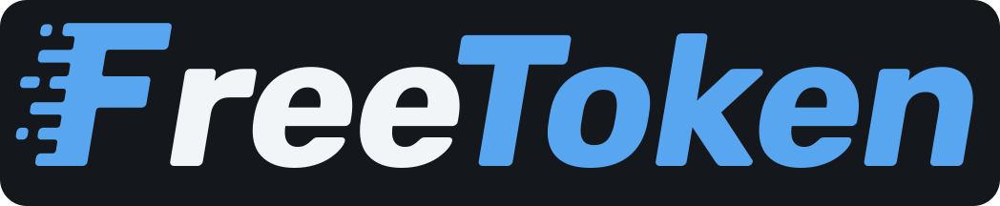

<div align="center">
  <picture>
    <source media="(prefers-color-scheme: dark)" srcset="./assets/freetoken-logo-dark.svg">
    <source media="(prefers-color-scheme: light)" srcset="./assets/freetoken-logo-light.svg">
    
  </picture>
</div>

<p align="center">
| <a href="https://www.flashml.ai/"><b>Download</b></a> | <a href="https://arxiv.org/abs/2608.16157"><b>Paper</b></a> | <a href="https://join.slack.com/t/flashml/shared_invite/zt-3zpdh5j10-9dwTXrgLiqpVxizhA9KVbA"><b>Developer Slack</b></a> | <a href="https://discord.gg/xzwSnMdsX"><b>Community Discord</b></a> |
</p>

A local, MoE-offload inference runtime with an OpenAI- and Anthropic-compatible
HTTP API — Run DeepSeek-V4-Flash on your 5090 with 20+ TPS.


## Quick start

See [docs/install.md](docs/install.md) for requirements and installation.

```bash
ft serve --model ~/models/Qwen3.6-35B-A3B   # API server on http://127.0.0.1:1919
ft launch claude                            # point an agent at it (codex / dsh / hermes / opencode / openclaw)
ft shell                                    # or chat in the terminal
```

## Documentation

- [Install](docs/install.md) — requirements and setup
- [Supported models](docs/models.md) — model × quantization
- [CLI reference](docs/cli.md) — `ft` commands and environment variables

## Acknowledgment

FreeToken was deeply inspired by [mini-sglang](https://github.com/sgl-project/mini-sglang), and
learned the design and reused code from the following projects:
[SGLang](https://github.com/sgl-project/sglang),
[vLLM](https://github.com/vllm-project/vllm),
[FlashInfer](https://github.com/flashinfer-ai/flashinfer),
[flash-linear-attention](https://github.com/fla-org/flash-linear-attention),
[LightLLM](https://github.com/ModelTC/lightllm) and [llama.cpp](https://github.com/ggml-org/llama.cpp).

## License

[Apache License 2.0](LICENSE).
